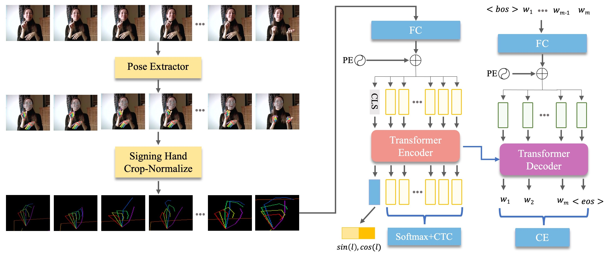

# [Fingerspelling PoseNet](https://arxiv.org/pdf/2311.12128.pdf): Enhancing Fingerspelling Translation with Pose-Based Transformer Models: 



1. Download the Chicago Fingerspelling dataset from [Here](https://home.ttic.edu/~klivescu/ChicagoFSWild.htm)
 
2. Extract Pose using Media-Pipe
  2.1. Install Media-Pipe [Here](https://github.com/google/mediapipe/blob/master/docs/solutions/pose.md)
3. Run Media-Pipe on input data using extract_pose_mediapipe.py
   
```
python extract_pose_mediapipe.py
```

4. Run

```
python train_with_lm.py
```
